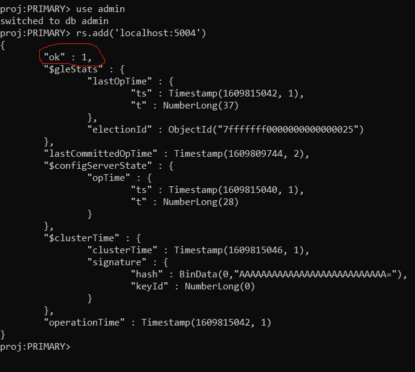
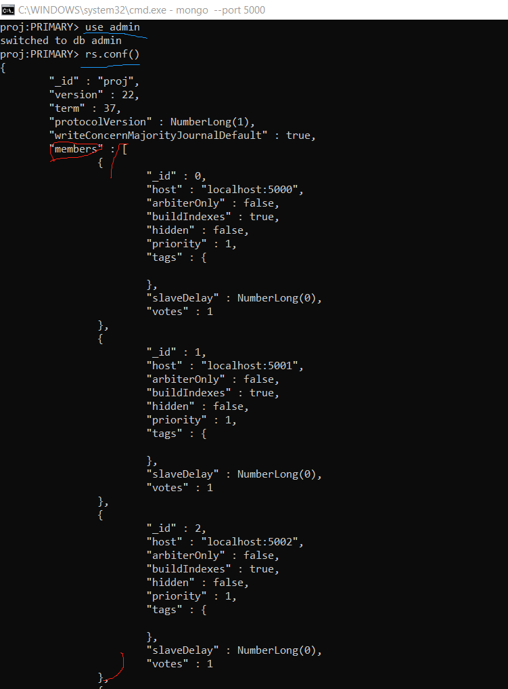

**There is a report on this project as ```report.pdf``` and slides illustrating the datacenter's architecture as ```presentation.pptx```. I also recorded a demo video but Github does not allow me to upload such video because it is too big. Please send me an email (```wg247@cornell.edu```) if you want to see the demo video**


@author Wentao Guo @email wg247@cornell.edu

@author Haoshen Li @email hl2239@cornell.edu

<h3>We need to first generate random articles/videos inside folder 'db' by executing <em>db/genTable_mongoDB.py</em></h3>

    python db/genTable_mongoDB.py


<h3>Note：we need to open a new terminal whenever we need to turn on a Mongos/Mongod server because once a server is started, it will run forever until we close the terminal so we cannot issue any subsequent command on this terminal.</h3>


1. Start 4 mongods servers by the following commands. Note that we can use any address for --dbpath. 
**We need to open a new terminal once a mongod server is started**：


    ```mongod --port 5000 --dbpath D:\MongoDB\proj-ddbms\repl_1 --noauth --replSet proj --shardsvr```

    ```mongod --port 5001 --dbpath D:\MongoDB\proj-ddbms\repl_2 --noauth --replSet proj --shardsvr```

    ```mongod --port 5002 --dbpath D:\MongoDB\proj-ddbms\repl_3 --noauth --replSet proj --shardsvr```

    ```mongod --port 5003 --dbpath D:\MongoDB\proj-ddbms\repl_4 --noauth --replSet proj --shardsvr```


2. Check if our server is started by typing ```mongo --port 5000``` in terminal.

    (The word "primary/secondary" will be shown after we deploy a replica set)


    We then type the following commands in this shell 
            
    ```use admin```

    ```rs.initiate()```

    ```rs.add('localhost:5001)```

    ```rs.add('localhost:5002)```

    ```rs.addArb('localhost:5003)```

3. Deploy a config server (**We also need to open a terminal for each commd in the first 3 lines. The later 5 commands are executed in the same terminal**):

    ``` mongod --port 6000 --dbpath D:\MongoDB\proj-ddbms\cfg_1 --noauth --configsvr --replSet projCfg ```

    ``` mongod --port 6001 --dbpath D:\MongoDB\proj-ddbms\cfg_2 --noauth --configsvr --replSet projCfg ```

    ``` mongod --port 6002 --dbpath D:\MongoDB\proj-ddbms\cfg_3 --noauth --configsvr --replSet projCfg ```

    ```mongo --port 6000```

    ```use admin```

    ```rs.initiate()```

    ```rs.add('localhost:6001)```

    ```rs.add('localhost:6002)```


4. Deploy a router (**We also need to open a terminal for the first command**)
    
    ```mongos --configdb projCfg/localhost:6000,localhost:6001,localhost:6002 --port 1000```

    We execute these 3 commands in one terminal.

    ```mongo --port 1000```

    ```use admin```

    ```db.runCommand({addshard:"proj/localhost:5000,localhost:5001,localhost:5002,localhost:5003"})```


6. We need to create a new replica set for DBMS2.

    ```mongod --port 7000 --dbpath D:\MongoDB\proj-ddbms2\repl_1 --noauth --replSet proj2 --shardsvr```

    ```mongod --port 7001 --dbpath D:\MongoDB\proj-ddbms2\repl_2 --noauth --replSet proj2 --shardsvr```

    ```mongod --port 7002 --dbpath D:\MongoDB\proj-ddbms2\repl_3 --noauth --replSet proj2 --shardsvr```
    
    
    The following 5 commands are executed in one terminal.

    ```mongo --port 7000```
    
    ```use admin```
    
    ```rs.initiate()```
    
    ```rs.add('localhost:7001)```
    
    ```rs.add('localhost:7002)```

    --end--

    These 3 commands are executed in 3 different terminals.

    ```mongod --port 8000 --dbpath D:\MongoDB\proj-ddbms2\cfg_1 --noauth --configsvr```

    ```mongod --port 8001 --dbpath D:\MongoDB\proj-ddbms2\cfg_2 --noauth --configsvr```

    ```mongod --port 8002 --dbpath D:\MongoDB\proj-ddbms2\cfg_3 --noauth --configsvr```

    The following 5 commands are executed in one terminal.

    ```mongo --port 8000```
    
    ```use admin```
    
    ```rs.initiate()```
    
    ```rs.add('localhost:8001)```
    
    ```rs.add('localhost:8002)```

    --end--

    Again, open a new terminal.

    ```mongos --configdb proj2Cfg/localhost:8000,localhost:8001,localhost:8002 --port 2000```


    These 3 commands are executed in 3 different terminals.

    ```mongo --port 2000```

    ```use admin```

    ```db.runCommand({addshard:"proj2/localhost:7000,localhost:7001,localhost:7002"})```
    
    --end--

 7. Start <em>redis-server.exe</em> and make sure the port is set as default (port# 6379)

 8. Open $HADOOP_HOME/sbin folder，run <em>start-all.sh</em> on macOS/Linux or <em>start-all.cmd</em> on Windows.

 <h3>Don't change the sequence of the running scripts</h3>

 9. ```python readraw.py``` to insert documents into User/Article/Read table

 10. ```python main.py``` to perform some queries on User/Article/Read table with/without join

 11. ```python pop_rank_demo.py``` to do pop_rank / be_read computations + download Top-5 Read Articles from HDFS
 12. ```python server_status_demo.py``` do a demo of logging server status

 13. ```python migrate.py``` do a demo of data migration to another data center at runtime

 14. ```python new_server_demo.py``` do a demo of adding a new server to existing data center at runtime

 15. ```python drop_server.py``` do a demo of dropping a secondary-node server at runtime

_________________


<ul><h2>Tips</h2>

<li>
To test if mongod is on: ```mongo --port [port number]```
    


</li>

<li>
To add a datanode is successfully to an existing replica set: open mongo shell on any running server of this replica set:

```mongo --port [running port number]```

```use admin```

```rs.add('localhost:[new datanode port number]')```


'ok' == 1 means success
</li>

<li>
Check a datanode status in mongo shell： 

```use admin```

```rs.conf()```

and we lookup the wanted host number in the 'members' field


</li>

<li>
Test if redis server is on： start redis-cli.exe (redis shell) and command <code>echo 'hello world'</code>
    

</li>

<li>
Test if HDFS is on： command <code>jps</code> in terminal, and if DataNode / ResourceManager / NameNode / NodeManager are all shown, we know our HDFS is still working


</li>
</ul>

_________________


<h3>Note：we can upload any files/directories into HDFS by executing <code>hdfs dfs -put [src addr] [dst addr]</code>, but I also create a jar file ('proj.jar') to faciliate uploading all files in <em>db/articles</em>. This implementation leverages multi-threads and prints current progress for every 10 seconds. Its source code can be found in <em>Main.java</em>. We only need to simply command <code>hadoop jar proj.jar</code> in terminal.</h3>

