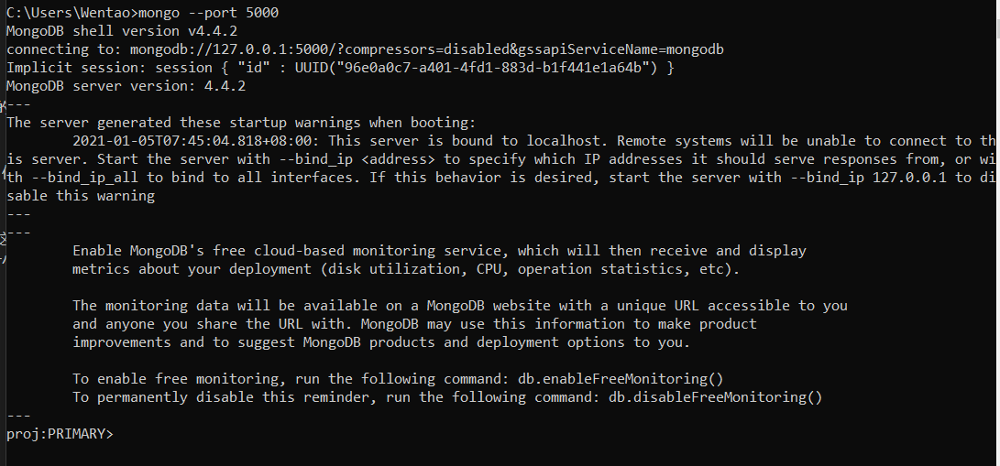
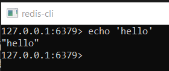
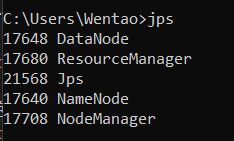

@author Wentao Guo (郭文韬) @email gwt20@mails.tsinghua.edu.cn | wg247@cornell.edu
@author Haoshen Li (李浩燊) @email li-hs20@mails.tsinghua.edu.cn | hl2239@cornell.edu

<h2>再跑之前，先去执行一下 db 文件夹中的 genTable_mongoDB.py ```python db/genTable_mongoDB.py```</h2>


<h2>注意：下面任何的mongod/mongos指令都是开启一个新的mongo服务器的，因为mongo服务器在terminal里面开启后会一直跑，所以遇到mongod/mongos指令一定要新开一个terminal执行</h2>


1. 执行MongoDB指令创立server, --dbpath随便选一个本机文件夹就行（改下面的--dbpath后面参数，提供一个绝对路径即可）**注意这里每输入一个指令要开个新的terminal输入下一个，因为server启动后关闭terminal会连带着关闭server**：


    ```mongod --port 5000 --dbpath D:\MongoDB\proj-ddbms\repl_1 --noauth --replSet proj --shardsvr```

    ```mongod --port 5001 --dbpath D:\MongoDB\proj-ddbms\repl_2 --noauth --replSet proj --shardsvr```

    ```mongod --port 5002 --dbpath D:\MongoDB\proj-ddbms\repl_3 --noauth --replSet proj --shardsvr```

    ```mongod --port 5003 --dbpath D:\MongoDB\proj-ddbms\repl_4 --noauth --replSet proj --shardsvr```


2. 打开termainl, 输入 ```mongo --port 5000```可以看到进入了一个mongo shell界面

    (下面的primary/secondary在成功部署了replica set后会出现)


3. 按顺序输入
            
    ```use admin```

    ```rs.initiate()```

    ```rs.add('localhost:5001)```

    ```rs.add('localhost:5002)```

    ```rs.addArb('localhost:5003)```

4. 搭建config server (**前三个指令和上面一样，不要关掉terminal而是要开一个新terminal输入下一个**):

    ``` mongod --port 6000 --dbpath D:\MongoDB\proj-ddbms\cfg_1 --noauth --configsvr --replSet projCfg ```

    ``` mongod --port 6001 --dbpath D:\MongoDB\proj-ddbms\cfg_2 --noauth --configsvr --replSet projCfg ```

    ``` mongod --port 6002 --dbpath D:\MongoDB\proj-ddbms\cfg_3 --noauth --configsvr --replSet projCfg ```

    ```mongo --port 6000```

    ```use admin```

    ```rs.initiate()```

    ```rs.add('localhost:6001)```

    ```rs.add('localhost:6002)```


5. 搭建router (**第一个指令也是不要关掉terminal, 下一个指令在新的terminal里面打开**)
    
    ```mongos --configdb projCfg/localhost:6000,localhost:6001,localhost:6002 --port 1000```

    这三个指令在同一个terminal里面执行

    ```mongo --port 1000```

    ```use admin```

    ```db.runCommand({addshard:"proj/localhost:5000,localhost:5001,localhost:5002,localhost:5003"})```


6. 对于DBMS2，我们再创建一个replica set，基本是重复上面步骤 (dbpath也是随便选一个本机的空文件夹就行)

    ```mongod --port 7000 --dbpath D:\MongoDB\proj-ddbms2\repl_1 --noauth --replSet proj2 --shardsvr```

    ```mongod --port 7001 --dbpath D:\MongoDB\proj-ddbms2\repl_2 --noauth --replSet proj2 --shardsvr```

    ```mongod --port 7002 --dbpath D:\MongoDB\proj-ddbms2\repl_3 --noauth --replSet proj2 --shardsvr```
    
    
    下面五步，同一个terminal里面执行

    ```mongo --port 7000```
    
    ```use admin```
    
    ```rs.initiate()```
    
    ```rs.add('localhost:7001)```
    
    ```rs.add('localhost:7002)```

    --end--

    下面三步，在三个<h3>**不 同 的**</h3>terminal里面执行

    ```mongod --port 8000 --dbpath D:\MongoDB\proj-ddbms2\cfg_1 --noauth --configsvr```

    ```mongod --port 8001 --dbpath D:\MongoDB\proj-ddbms2\cfg_2 --noauth --configsvr```

    ```mongod --port 8002 --dbpath D:\MongoDB\proj-ddbms2\cfg_3 --noauth --configsvr```

    下面五步，同一个terminal里面执行

    ```mongo --port 8000```
    
    ```use admin```
    
    ```rs.initiate()```
    
    ```rs.add('localhost:8001)```
    
    ```rs.add('localhost:8002)```

    --end--

    又是要 **新开一个** terminal

    ```mongos --configdb proj2Cfg/localhost:8000,localhost:8001,localhost:8002 --port 2000```


    下面三步，同一个terminal里面执行

    ```mongo --port 2000```

    ```use admin```

    ```db.runCommand({addshard:"proj2/localhost:7000,localhost:7001,localhost:7002"})```
    
    --end--

    注：
    mongod成功连接并打开的界面 命令行内： ```mongo --port [port number]```
    (下面的primary/secondary在成功部署了replica set后会出现)
    
    

    mongo shell内成功添加一个datanode的成功样式： 先```use admin```, 然后```rs.add('localhost:[port number]')```

    
    注意: 'ok' == 1 代表成功，其他都是失败

    mongo shell内检查datanode： ```use admin```后, ```rs.conf()```打印出来的'members'信息

    
    注意: ok == 1


    redis server还在跑的检测： 打开redis-cli.exe (redis shell) ```echo 'hello world'```
    
    


    hdfs还在跑的检测： 打开terminal 输入 ```jps```, 可以看到 DataNode / ResourceManager / NameNode / NodeManager 还在就说明还在跑

    

 7. 运行redis-server.exe, 确认跑的port是默认的6379（可以用redis-cli.exe查看，命令行里输入redis-cli

 8. 点开$HADOOP_HOME/sbin文件夹，假如是macOS/Linux就跑start-all.sh, 是windows就跑start-all.cmd

 <h2>注：下面的执行顺序不要改变</h2>

 9. ```python readraw.py```进行User/Article/Read Table读取插入

 10. ```python main.py```进行query with/without join

 11. ```python pop_rank_demo.py```进行pop_rank / be_read计算 + hadoop下载

 12. ```python server_status_demo.py```跑server status的展示

 13. ```python migrate.py```跑runtime migrate to another data center展示

 14. ```python new_server_demo.py```跑runtime add server展示

 15. ```python drop_server.py```跑runtime drop server展示


  注：想上传hdfs文件执行  ```hdfs dfs -put [src] [dst]```就行，但我实现了一个jar ('proj.jar')专门针对上传 db/articles 里面生成的几十万个文件夹的 (可以记录上传成功/失败的文档，而且多线程执行+自动打印当前进程). 这个时候可以用 ```hadoop jar proj.jar```就行了

